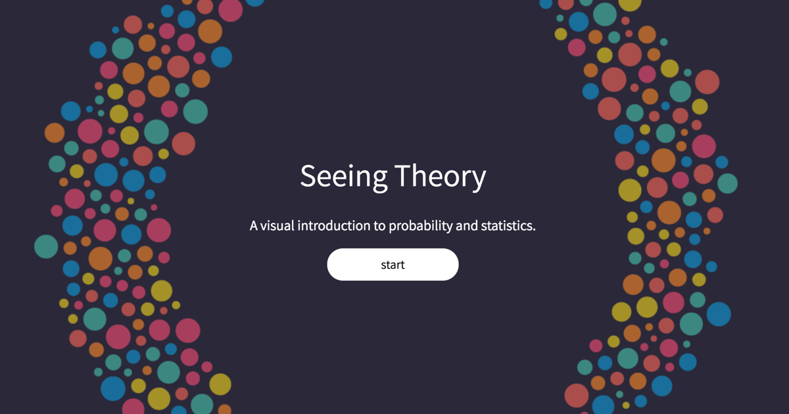

# [Seeing Theory](http://students.brown.edu/seeing-theory/) 

[](http://students.brown.edu/seeing-theory/) 

Seeing Theory is a project designed and created by Daniel Kunin with support from Brown University's [Royce Fellowship](https://www.brown.edu/academics/college/fellowships/royce/) Program. The goal of the project is to make statistics more accessible to a wider range of students through interactive visualizations.

## About

Statistics, is quickly becoming the most important and multi-disciplinary field of mathematics. According to the American Statistical Association, statistician is one of the top ten fastest-growing occupations and statistics is one of the fastest-growing bachelor degrees. Statistical literacy is essential to our data driven society. Yet, for all the increased importance and demand for statistical competence, the pedagogical approaches in statistics have barely changed. Using Mike Bostock’s data visualization software, D3.js, Seeing Theory visualizes the fundamental concepts covered in an introductory college statistics or Advanced Placement statistics class. Students are encouraged to use Seeing Theory as an additional resource to their textbook, professor and peers.

## Feedback and Suggestions

Found a bug or an issue with a visualization?  Have general feedback?  Want to get involved in the project?  [Contact us](mailto:info@seeingtheory.io).

## Integrating Seeing Theory

Embed a Seeing Theory visualization into your own page with an HTML iframe as shown below.

```
<iframe 
	src="http://students.brown.edu/seeing-theory/[unit]/index.html#[number]" 
	width="100%" 
	height="700px" 
	scrolling="no"
	style="margin-top: -70px;"
	frameborder="0">
</iframe>
```

## Copyright and License

Copyright 2016-2017.
